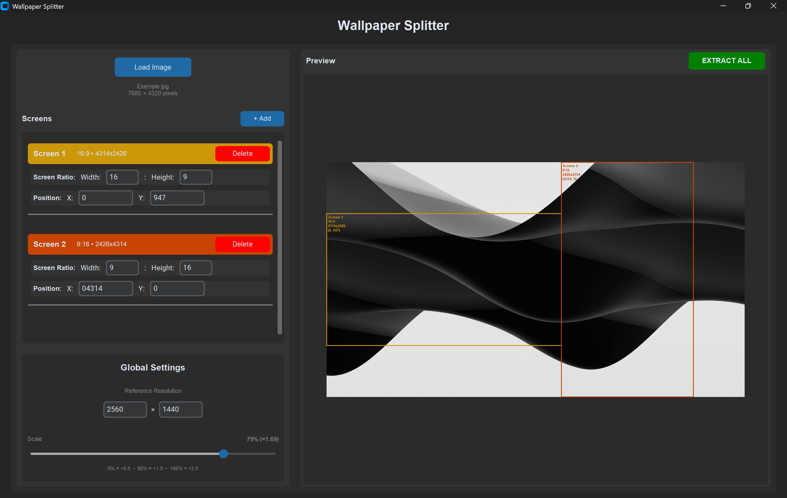

# Wallpaper Splitter

A Python GUI application for splitting wallpapers across multiple monitors with different resolutions and aspect ratios.

 [](https://www.gnu.org/licenses/gpl-3.0)  
___
## Overview
Wallpaper Splitter helps you create perfectly sized wallpaper segments for multi-monitor setups. Configure each screen's aspect ratio, position, and resolution, then extract individual wallpaper sections with a single click.
### Why
Multi-monitor setups with different resolutions and aspect ratios often make it hard to use a single wallpaper cleanly. 
Wallpaper Splitter automates this process and ensures each monitor gets a perfectly sized section of your image.
## Features
- **Multi-Monitor Support**: Configure unlimited screens with custom aspect ratios
- **Visual Preview**: See exactly how your wallpaper will be split
- **Flexible Scaling**: Adjust output resolutions using a reference resolution and scale slider
- **Custom Positioning**: Precisely position each screen crop area
- **Batch Export**: Extract all screen wallpapers at once
## Screenshots

## Installation
### Prerequisites
- Python 3.8 or higher
- pip (Python package manager)
### Dependencies
Install the required packages:
```bash
pip install -r requirements.txt
```
Or install manually:
```bash
pip install customtkinter pillow
```
### Running the Application
```bash
python main.py
```
## Usage
### Basic Workflow
1. **Load Image**: Click "Load Image" and select your wallpaper
2. **Add Screens**: Click "+ Add" to create screen configurations
3. **Configure Each Screen**: Set aspect ratio (e.g., 16:9, 21:9, 16:10)
4. **Set Global Settings**: Set reference resolution (e.g., 2560×1440)
5. **Adjust Size and Positioning**:
    - Adjust scale slider (0% = ×0.5, 50% = ×1.0, 100% = ×2.0)
    - Set position (X, Y coordinates on the wallpaper)
6. **Extract**: Click "EXTRACT ALL" and choose output folder
## File Naming
Extracted wallpapers are named automatically based on aspect ratio:
```
wallpaper_screen_16-9.png
wallpaper_screen_21-9.png
wallpaper_screen_16-10.png
```
If files exist, they're numbered: `wallpaper_screen_16-9_2.png`
## Development
### Project Structure
```
wallpaper-splitter/
├── main.py                  # Main application
├── requirements.txt         # Python dependencies
├── README.md                # This file
├── LICENSE                  # GNU GPL v3.0 License
└── .gitignore               # Git ignore rules
```
### Key Classes
- `ScreenConfig`: Represents a single screen configuration
- `ScreenConfigWidget`: UI widget for configuring a screen
- `GlobalConfigWidget`: UI for reference resolution and scale
- `WallpaperSplitterApp`: Main application class
## License
This project is licensed under the GNU GPL v3.0 License - see the LICENSE file for details.
## Acknowledgments
- Built with [CustomTkinter](https://github.com/TomSchimansky/CustomTkinter)
- Image processing by [Pillow](https://github.com/python-pillow/Pillow)
---

**Enjoy your perfectly split wallpapers! 🖼️**